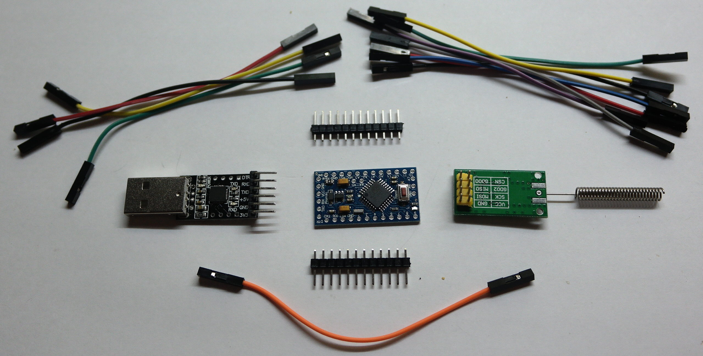
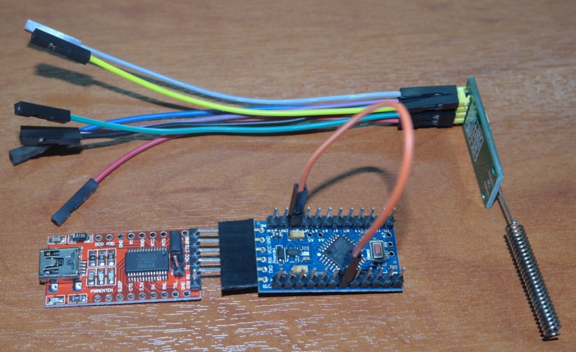
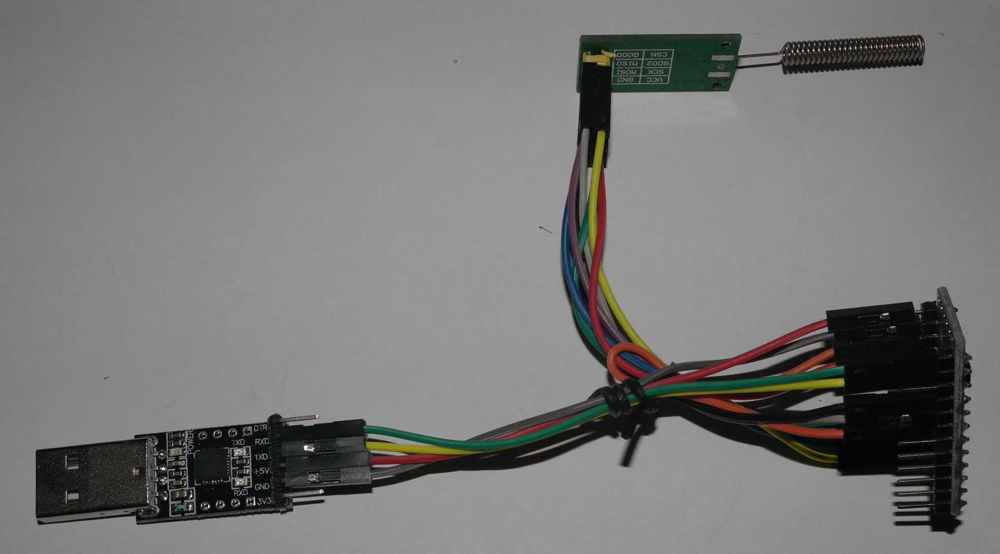

## Installation

In order to use rfboot succesfully there are quite a few steps initially but after that
the process is simple.
You need to:
- Install the needed software in the PC
- Assemble and configure the usb2rf module (Connects to a USB port of the PC)
- Configure rftool to use the usb2rf module
- Upload the apropriate firmware to usb2rf (An Arduino sketch)

### Install the apropriate software
First of all, a linux PC is needed for the development. I don't use Windows neither MAC
and is very difficult for me to support another platform. You can use VirtualBox if
you really need to use rfboot from Windows or Mac.
I tried with Virtualbox (a Linux Mint 17.3 image) and it is working perfectly.
Of course if you are unfamiliar with linux and especially the command line, the problem
remains.

I do all development on a Linux Mint 17.3 box. Maybe you need to adapt the procedure
for your environment. Open a terminal:

```bash
# this is recommended before start
> sudo apt-get update ; sudo apt-get upgrade

# This also installs avr compiler and avr-libc
> sudo apt-get install arduino-core arduino-mk

# A programmers editor. You can use another if you like.
# The instructions here, use geany as text editor
> sudo apt-get install geany

# a serial terminal. I suggest to use this serial terminal
# before try your luck with another one.
> sudo apt-get install gtkterm

# To easily download rfboot.
> sudo apt-get install git
```

The ubuntu/debian/mint packages are old (1.0.6) but work perfectly for rfboot purposes. I
didn't test the newer (post 1.0.6) arduino environments.

Download the rfboot repository in your PC. Place it in some relatively safe place in your
PC like ~/programming/

```bash
> mkdir ~/programming
> cd ~/programming
> git clone https://github.com/pkarsy/rfboot.git
```
The "rftool" utility needs to be in the PATH.
```bash
# if the ~/bin does not exist "mkdir ~/bin" and then logout and login again
> cd ~/bin
> chmod +x ~/programming/rfboot/rftool/rftool
# Do NOT copy rftool, just symlink it
> ln -s ~/programming/rfboot/rftool/rftool
```
Now if you type
```bash
> rftool
```
Should give you a small usage message. This means rftool is in the PATH. As you can see the
rftool is precompiled. It is a i386 statically linked executable, and it can run on any i386 or x86_64
linux system (you can recompile it of course if you want).

Now it is time to install mCC1101, a modified (and simplified) panStamp
CC1101 library. The skeleton projects created with "rftool create ProjName"
use this library. (You can modify the code to use another CC1101 library of course)

Change "~/sketchbook/libraries" with your actual sketchbook folder.

```bash
> cd ~/sketchbook/libraries
> git clone https://github.com/pkarsy/mCC1101.git
```

Linux by default does not give permission (to regular users) to
access the Serial ports, neither the ISP programmers. To fix it:

- Serial port
```bash
> sudo adduser myusername dialout
```
You need to logout and login again for the changes to take effect.
- ISP programmer

```bash
> sudo nano /etc/udev/rules.d/52-my.rules
```
Add the lines
```sh
# USBasp
ATTR{idVendor}=="16c0", ATTR{idProduct}=="05dc", MODE="666"

# USBtiny
ATTR{idVendor}=="1781", ATTR{idProduct}=="0c9f", MODE="666"
```

In the command line
```bash
> sudo service udev restart
```

***Software installation is done !***

### usb2rf module

***WARNING: The red FTDI modules (USB-to-Serial, it seams they have a fake FTDI chip) are very unreliable. A lot of failed uploads, and mysterious CRC errors, dissapeared by using a CP2102 or Pl2303 USB-to-Serial module.<br/>
I dont't have a genuine FTDI module to test it. Maybe the problem is power related as the FTDI regulator powers the ProMini and the CC1101 module.<br/>
I didn't investigate further, as CP2102 is working perfectly.***

To build the usb2rf module you need :
- A CP2102 module ( A CP2104 or a PL2303 is also OK)
- ProMini 3.3V. Do not use a 5V ProMini. CC1101 cannot tolerate 5V.
- CC1101 module (I use D-SUN modules)
- some female-female jumper wires (2.54mm spacing).

```
+----------+
|          |         +--------+          +----------+         +--------+
| gtkterm  |  <--->  | CP2102 |  <--->   | Pro mini |  <--->  | CC1101 |
| rftool   |   USB   +--------+  Serial  +----------+   SPI   +--------+
+----------+
   PC                |                   usb2rf module                 |
                     +-------------------------------------------------+
```

Here is a photo of the materials we need


***Serial connection (CP2102<-->ProMini)***

4 cables are required :

CP2102 | Cable COLOR | Pro Mini
---- | ----- | --------
GND  | Black |GND
5V   | Red | RAW
TX   | Yellow | RX
RX   | Green |TX

ProMini regulates the 5V from RAW pin to 3.3V. CP2101 has also an internal 3.3 regulator and the 2 modules
can communicate without the need for logic level conversion.<br/>
Notice: CC1101 also has a 3.3V output but I am not sure
that the current is enough to power ProMini+CC1101 so don't use it. 5V is working perfectly anyway.

***SPI connection (ProMini<-->CC1101)***

7 cables are required :

CC1101 PIN | Cable COLOR | ProMini pin
------------- | ----------- | -----------
GND | Black | GND
VCC | Red | VCC(3.3V)
CSN | Yellow | 10
SCK | Green | 13
MOSI | Blue | 11
MISO | Violet | 12
GDO0 | Gray | 2
GDO2 |  | Not Connected

CC1101 is working fine with 3.3V, so again no level conversion is needed.

Now connect the proMini pins D3 and RST (Orange cable).
See [Explanation](usb2rf-reset.md)



And here is the final module



### Assign the CP2102 a unique serial ID
This is mandatory if you are going to have more than one CP2102
modules connected to your PC at the same time.
Be sure there is only one CP2102 module connected to the PC.<br/>
http://cp210x-program.sourceforge.net/<br/>
Download the latest tarball and then
sudo ./cp210x-program -w --set-serial-number="random_serial"<br/>
"random_serial" should be unique for every module ie 12F34 25317 etc.<br/>
The CP2104 chip seems to have already unique ID, so this step is not needed.<br/>
The Pl2303 chip cannot programmed, so if you are going to use this chip, you
have to use only one, and use other brands, if you need to connect other
USB-to-Serial modules.<br/>
The FTDI modules also have unique serial IDs but as I said I have reliablility problems
with them(non genuine chips).


### Configure rftool to use the usb2rf module
```bash
> rftool addport
```
and insert the usb2rf module. rftool detects it and saves the Serial port device
to ~/.usb2rf file.

Note: Sometimes the module is detected as "/dev/ttyUSB0". Another time as "/dev/ttyUSB1", and so
on. rftool instead searches the "/dev/serial/by-id" directory and always finds the correct usb2rf module.
You can have more than one usb2rf devices and rftool will use the first one connected.

### Burn the appropriate firmware to usb2rf

This step will work only if you already done the "rftool addport" step above.
Also ensure the module is the only one connected (if you happen to have more than one)
To upload the precompiled .hex
```bash
> cd usb2rf
> make sendHex
```
You may need to press proMini reset button as auto-reset does not work.

As always, you can build the sketch yourself. (See [usb2rf/README.md](../usb2rf/README.md) )

***Hardware and software setup is done !***

Continue with
[The First Project](The-First-Project.md)

