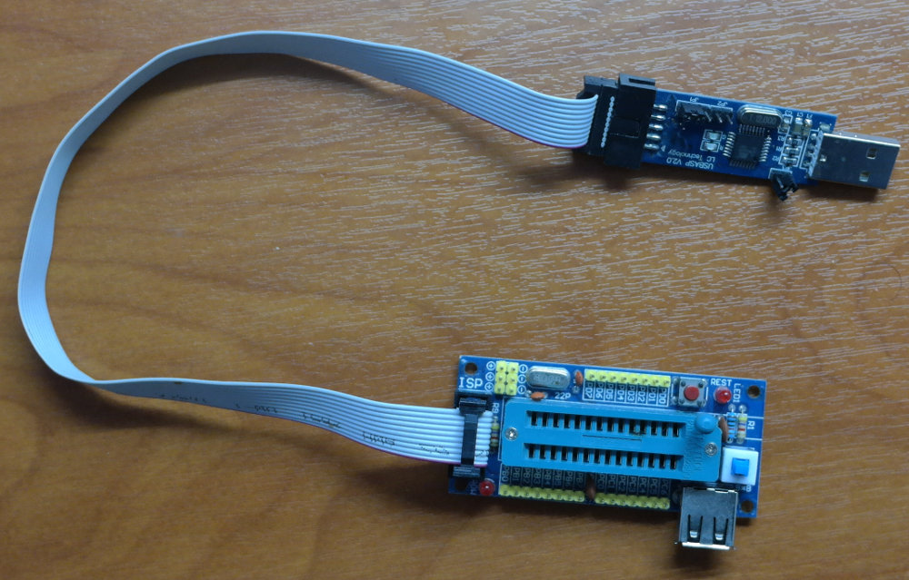
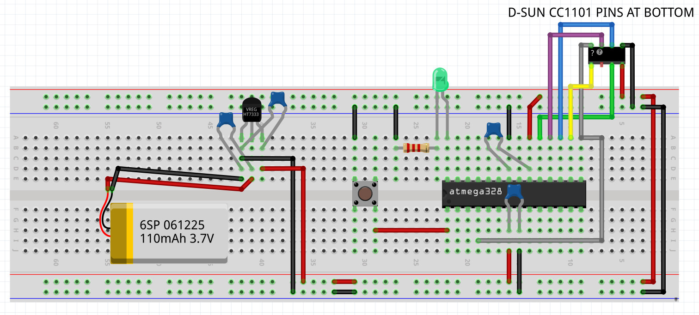

### The First Project

Before you proceed, it is required that you have completed the
[Installation of rfboot](Installation.md)

### Bill of materials
- atmega328p-pu
- 2 ceramic caps 1uF (Optional, for voltage stability near MCU)
- A momentary pushbutton (optional, for reset)
- A cc1101 RF module with 2.54 pin spacing. The photos show a D-SUN module
- A LED with a suitable resistor.
- Male to female 2.54 jumper wires, and some simple striped wires
- A 3.3V stabilized power source.<br/>
For example A lithium-ion cell with a 3.3V regulator and
2 additional 1uF caps. LP2950-3.3 and HT7333 are very good for this purpose. See picture.<br/>
Do not use LM7833 or L78L33 or other non LDO regulators unless your power source voltage is at least 5V. On the other hand some
3.3V regulators can handle voltages up to 6V only, so be careful.
- ISP programmer with a 28pin ZIF socket. The ISP programmer is used only once
for each project, to write rfboot to the target MCU.
- A breadboard. Note that a breadboard with loose connections is a basic source of failures when prototyping.


On the PC, prefferably in you sketchbook folder type :
```sh
> rftool create myProject
```

and you will get something like this:
```sh

Application SyncWord = 28,120
rfboot SyncWord = 167,224
rfboot channel = 0
Application channel = 3

```

As you can see rftool generates random parameters (using /dev/urandom), and creates
a "myProject" folder containing all information/data our project needs.

```sh
> cd myProject
```
Now it is time to burn the atmega with rfboot, using the ISP programmer.

Here is a photo of the USBasp programmer together with a ZIF developer board. (search ebay)

If you have a USBtiny ISP programmer, edit the file "rfboot/hardware_settings.mk" and uncomment
the USBtiny line. Put the atmega328p-pu chip on the ZIF socket and :

```sh
> make isp
```
To write the bootloader.
If a project uses a crystal you can edit "rfboot/hardware_settings.mk" before burn.


Do not do this (use a crystal) on this first project however, to keep things simple.
Rfboot works perfectly with (uncalibrated up to 10% error) internal oscillator,
because SPI is synchronous.
UART Serial bootloaders on the other hand need a relatively accurate +-2% clock,
otherwise they cannot communicate at all. This is the reason all arduino boards
come with crystal/resonator.

Here is how our project looks like. It is not connected with anything, and we are going to program it wirelessly.


Now put the atmega and the other components in the breadboard,
and power the board.</br>
From now on, you need the usb2rf module (See [Installation](Installation.md)) connected.

```sh
# Opens gtkterm with all apropriate options
> make terminal

# Sends the firmware via the RF link
> make send
```

The "myProject" folder contains a arduino .ino file, in this case "myProject.ino". As is, the program prints a "hello world", it waits for a keypress from the serial terminal, and after that it prints back what you pressed. The purpose of the program is to ensure that all components are correctly wired and working.

If you were succesful, you can start playing with the code.
All arduino code is working as expected, <b>with the important exception of Serial.print()</b> wich sends data to the hardware serial port but <b>NOT</b> to the RF link. The
PRINT and PRINTLN macros can be used instead which use sprintf internally.
```C++
i=2;
PRINT("i=%d",i);
j=7;
k=8;
PRINTLN("j=%d and k=%d",j,k);
```
As you can see they look like the standard printf function. They send data via the RF link, the usb2rf module receives the data, and we can see them with a serial port terminal (we use gtkterm at 38400 bps)

Now uncomment the lines related to the LED, inside setup()
and loop() in order to have the LED blinking.

A very importand feature of rfboot is that it does NOT use any EEPROM location to store RF
channel etc. All parameters are stored in the compiled bootloader, and the application can
use the whole EEPROM.

***The first rfboot based project is finished !***

Spend 2 minitues to configure geany (or your editor) to execute

"make terminal"

"make clean"

"make send"

with a menu entry, or keyboard shortcut


